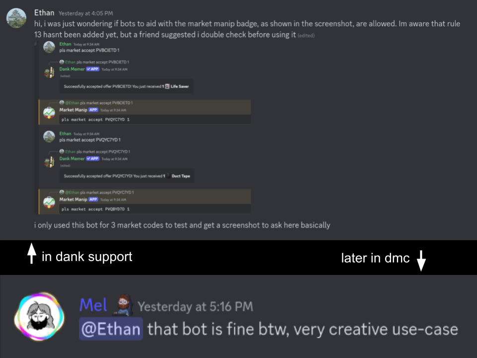

## Market Badge Assistant

A self-hosted Discord bot that aids you in grinding Dank Memer's "Market Manipulator" badge

#### Assumptions

-   You are grinding the badge on a computer (and NOT on a phone)
-   You have an alt account to post all of your market offers
    (this makes copying the private offer IDs a lot more convenient)
-   You are using the bot in a private server with almost nothing in it
-   You are the ONLY person using this bot!

I didn't bother adding support for multiple users on one instance because i'm fucking stupid and lazy

The bot will only respond to the owner of the bot _account_ (aka you, the reader)

#### Installation

1.  **You will need a Rust compiler.**
    You can install the Rust toolchain [here](https://rustup.rs/)

2.  **Clone this repo**

    ```sh
    git clone https://github.com/fuh-Q/market-badger
    cd market-badger
    ```

3.  **Create a bot application on Discord's Developer Portal**

    Go to the [dev portal](https://discord.com/developers) and create an application. Next, you'll wanna go to the "Bot" tab, and scroll down to the bottom. Flick on the switch labeled "Message Content Intent", and make sure you save your changes!

    
    

    After that, head to the OAuth2 tab on the left. This is where you will obtain an invite link for your bot

    Select the "bot" scope from the list, and choose whatever permissions you want your bot to have. I recommend just fucking and chucking it with full Admin perms, because I made this bot under the assumption that it's being used in a private server with basically nothing in it

    

    You can now copy your invite URL at the bottom, paste it in your browser, and add the bot to a server

    

    Finally, go back the "Build-A-Bot" page in the Bot tab, where you'll wanna reset and **_COPY YOUR TOKEN!_** (this is important)

    
    

4.  **Configure the bot**

    To start, create two files in the `market-badger` directory:

    -   `token.txt`
    -   `codes.txt`

    Firstly, you'll wanna paste your token into the `token.txt` file

    For `codes.txt`, you first need to post ALL of your market offers as **_PRIVATE_** offers, then transcribe the offer IDs into this file, separated by newlines (the bot will only read lines that begin with `PV`, the common prefix for private market offers)

5.  **Run the bot**

    To run the bot, ensure that your command terminal is in the `market-badger` directory, and simply type

    ```sh
    cargo run --release
    ```

    Anytime you want to start the bot again, just re-run the above command

#### Usage

The bot has a `!ping` command, which allows you to verify that it's online.
To start grinding, run `pls market accept` on your FIRST market offer in the `codes.txt` file, and the bot will begin cycling through the offer IDs specified in `codes.txt`. You MUST run all commands using the `pls` prefix.

The bot will begin your flow on your second market code, assuming that you accepted your first offer to begin your grind.

Each flow message is sent with two buttons:

-   "Skip current" will skip the current offer
-   "Skip until" will skip to a specific offer, and thus enables _restoring your flow position through bot restarts_

#### Tips for grinding

<details>
<summary>Codeblock copy button</summary>

Discord codeblocks have a copy button, as shown below


</details>
<details>
<summary>Use your tab key!</summary>

Using your tab key (and shift+tab), you can navigate between interactive elements of the Discord client. This allows you to click the Dank Memer confirmations using only your keyboard, and allows you to keep your mouse cursor focused on the copy button mentioned in the last point

</details>
<details>
<summary>100 offers recommended</summary>

Partial market offers have a 5 minute acceptance cooldown. I personally recommend posting **100 private offers** to ensure a smooth grind hitting no cooldowns. Assuming it takes 3 seconds to accept a single offer, it should theoretically take 300 seconds (or 5 minutes) to accept 100 offers

</details>

#### Is this allowed?

Yes, we've been approved by Mel himself



#### Why private offers?

Because it was more ergonomic for me to code it this way, also because _why not_.
Private offers are both cheaper to post, AND they reduce the risk of having someone else accept your offers

#### Questions?

Ping `gdkid` in [this server](https://discord.gg/gKEKpyXeEB)
