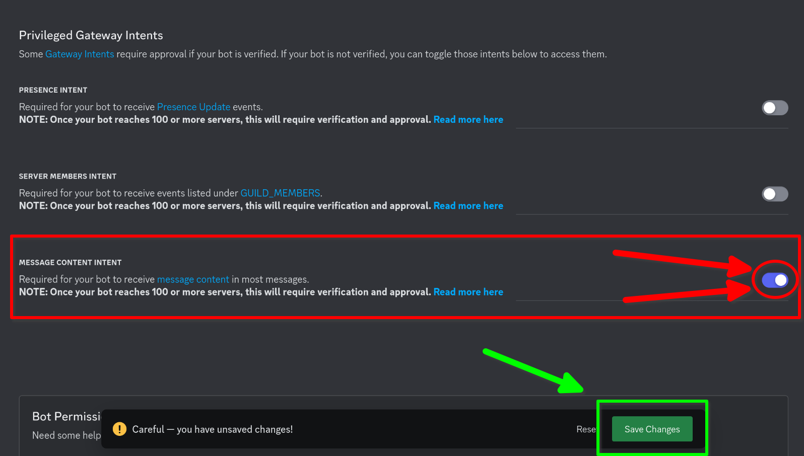

## Market Badge Assistant

A self-hosted Discord bot that aids you in grinding Dank Memer's "Market Manipulator" badge

#### Assumptions

-   You are grinding the badge on a computer (and NOT on a phone)
-   You have an alt account to post all of your market offers
    (this makes copying the private offer IDs a lot more convenient)
-   You are using the bot in a private server with almost nothing in it

#### Installation

1. **You will need a Rust compiler.**
   You can install the Rust toolchain [here](https://rustup.rs/)

2. **Clone this repo**

    ```sh
    git clone https://github.com/fuh-Q/market-badger
    cd market-badger
    ```

3. **Create a bot application on Discord's Developer Portal**

    Go to the [dev portal](https://discord.com/developers) and create an application. Next, you'll wanna go to the "Bot" tab, and scroll down to the bottom. Flick on the switch labeled "Message Content Intent", and make sure you save your changes!

    
    

    After that, head to the OAuth2 tab on the left. This is where you will obtain an invite link for your bot

    Select the "bot" scope from the list, and choose whatever permissions you want your bot to have. I recommend just fucking and chucking it with full Admin perms, because I made this bot under the assumption that it's being used in a private server with basically nothing in it

    

    You can now copy your invite URL at the bottom, paste it in your browser, and add the bot to a server

    

    Finally, go back the "Build-A-Bot" page in the Bot tab, where you'll wanna reset and **_COPY YOUR TOKEN!_** (this is important)

    
    

4. **Configure the bot**

    You will notice two files in the `market-badger` directory:

    - `token.txt`
    - `codes.txt`

    Firstly, you'll wanna paste your token into the `token.txt` file.

    For `codes.txt`, you first need to post ALL of your market offers as **_PRIVATE_** offers, then transcribe the offer IDs into this file, separated by newlines (the bot will only read lines that begin with `PV`, the common prefix for private market offers)

5. **Run the bot**

    To run the bot, ensure that your command terminal is in the `market-badger` directory, and simply type

    ```sh
    cargo run --release
    ```

    Anytime you want to start the bot again, just re-run the above command

#### Usage

The bot has a `!ping` command, which allows you to verify that it's online.
To start grinding, run `pls market accept` on ANY market offer, and the bot will begin cycling through the offer IDs specified in `codes.txt`. You MUST run all commands using the `pls` prefix.


#### Questions?

Ping `gdkid` in [this server](https://discord.gg/gKEKpyXeEB)
